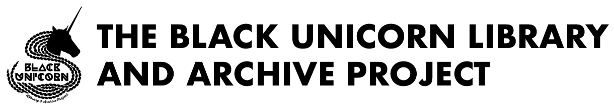

# Public-History-Working-Group
The [**Black Unicorn Library &amp; Archives**](http://www.theblackunicornlibrary.org) and the [**Pittsburgh Queer History Project**](http://www.pittsburghqueerhistory.com) have created a creative research in public history curriculum with support from the TEN:TACLES Initiative.

<h1>Participant Resources</h1>

[Agendas](Course-Design/Agendas)

[Readings]

[Tutorials] (pending)

**Applications for Summer 2025 Closed May 1st**

Please send questions about the program to "pghpublichistoryschool [at] proton.me 
